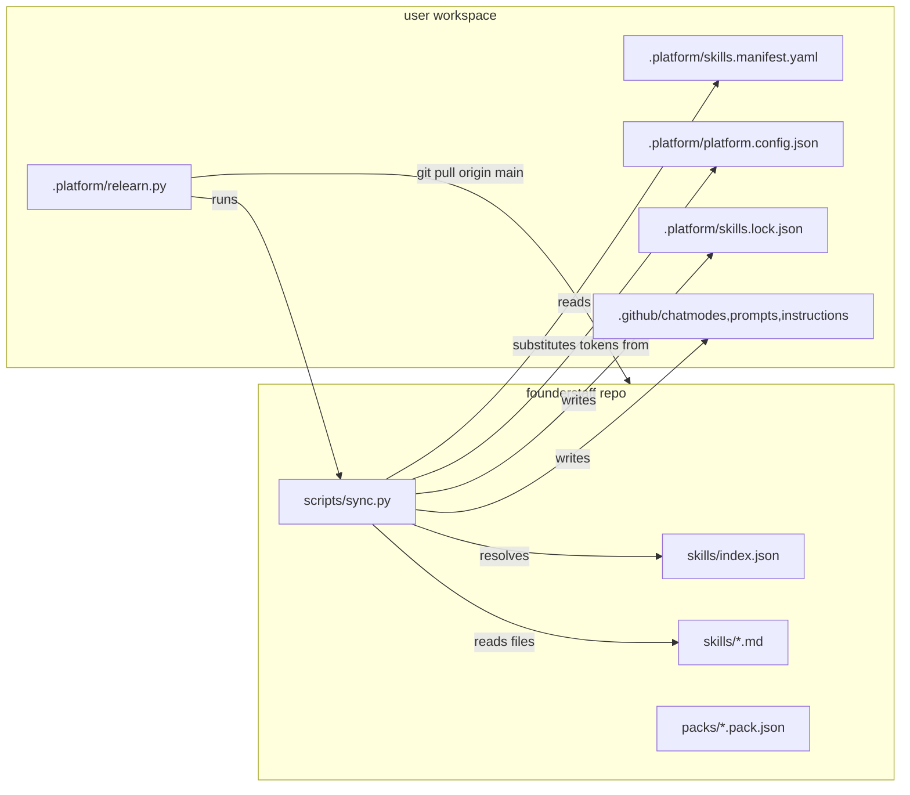

# Architecture

## Goal

Let any founder, in one command, get a Copilot-native business operating system tailored to their idea — and keep it evolving as the platform itself ships new skills.

## High-level dataflow

## Why a package manager, not git submodules

Tried both on paper. Submodules nest skill files under a subdir; Copilot only auto-discovers files in `<workspace>/.github/`. On Windows, symlinking submodule contents into `.github/` is fragile (admin requirement, antivirus). Package-manager-with-copy avoids the whole class.

## Why Python, not PowerShell

- Cross-platform from day one (macOS users will arrive once we go public).
- Stdlib `subprocess`, `hashlib`, `json`, `pathlib`, `re` are sufficient — no `pip install` needed for the happy path.
- Optional `yaml` import upgrades manifest expressiveness when available, mini-parser handles the basic case.

## Why a separate `relearn.py` wrapper

So users never need to know where `founderstaff` lives on their disk. The wrapper:

1. Reads the manifest in `.platform/skills.manifest.yaml`.
2. Clones-or-pulls the upstream into `~/.founderstaff/cache/<slug>/`.
3. Re-invokes `<cache>/scripts/sync.py` with the same args.

This means the user can run `python .platform/relearn.py` from any workspace and self-heal the cache.

## Sync algorithm (8 steps)

See [skill-distribution.md](skill-distribution.md) for the authoritative spec. Summary:

1. Resolve manifest path; load packs + extras + disabled.
2. `git pull origin <branch>` on cache repo.
3. Read upstream `skills/index.json`, `packs/*.pack.json`.
4. Compute transitive closure of wanted skills via `depends_on`.
5. For each wanted skill: substitute tokens, hash, compare to lockfile's recorded hash.
6. Skip files with user-edited hashes; install/update otherwise.
7. Prune skills no longer wanted (and not locally edited).
8. Persist new `skills.lock.json`.

## Token substitution

- Regex: `{{[A-Z0-9_]+}}`.
- Values come from `.platform/platform.config.json#tokens`.
- Unsubstituted tokens are left intact — surface as warnings, not errors.

## Versioning model

| Layer | What bumps | Lives in |
|---|---|---|
| Platform | breaking sync protocol → major; new pack category → minor | `version.json` |
| Pack | new skill → minor; reorder → patch | `packs/*.pack.json#version` |
| Skill | breaking interface → major; behavior shift → minor; copy tweak → patch | `skills/index.json` |

## Decision log

| # | Date | Decision | Status |
|---|---|---|---|
| 1 | 2026-05-22 | Package manager over submodules | accepted |
| 2 | 2026-05-22 | Python stdlib for sync engine | accepted |
| 3 | 2026-05-22 | Hash-based local-edit detection | accepted |
| 4 | 2026-05-22 | `git pull origin` over `pip install` packaging | accepted |
| 5 | TBD | Auto-generate `index.json` from frontmatter? | open (see AGENTS.md) |

## Failure modes & mitigations

| Failure | Mitigation |
|---|---|
| User edited a synced file | Hash mismatch detection; skip with warning |
| Upstream renamed a skill | `aliases` field in `index.json` (planned v0.2) |
| Pack references missing skill | Sync prints warning, continues |
| Cyclic dependency | Resolver uses memoization — visited set prevents infinite recursion |
| Network down | Cache repo persists; sync uses last-known-good |
| Token missing from config | Left literal; warn so user can fix |
