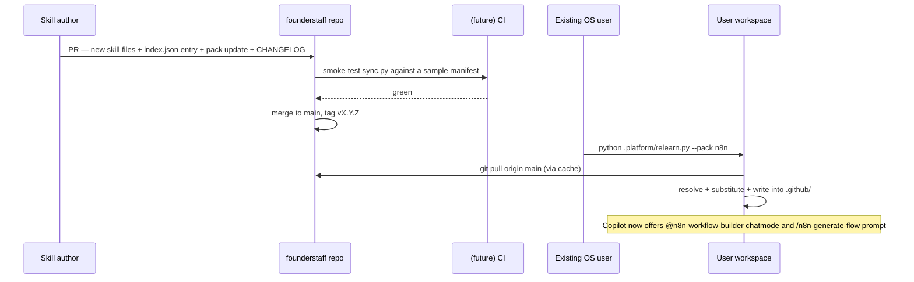

# Self-evolution: how founderstaff grows itself

The single user promise is:

> When the platform adds a new skill category — say `n8n` workflow automation or faceless `video` production — existing users get it by running **one command**.

## The flow



## What this requires from authors

1. **Authoring** the skill files under `skills/{chatmodes,prompts,instructions}/`.
2. **Registering** in `skills/index.json`.
3. **Bundling** by adding to one or more `packs/*.pack.json`.
4. **Versioning** — bump the pack and (when adding a category) the platform.
5. **Logging** — CHANGELOG entry.

That's the whole release ritual. Authors do not touch user workspaces.

## What this requires from users

```bash
python .platform/relearn.py            # pull current pinned packs
python .platform/relearn.py --pack n8n # opt in to a new pack
python .platform/relearn.py --status   # audit installed skills
```

## Why this works

- Skills are **plain markdown** — Copilot scans `.github/` and surfaces them automatically. No extension install, no setup.
- Skills are **plain markdown** — easy to PR, diff, and review.
- Sync is **idempotent** — running `relearn` twice does nothing the second time.
- Sync is **safe** — local edits are detected by hash and protected.

## Anti-patterns (do not do)

- ❌ Don't ship skills as a separate npm/pip package. Adds dependency friction without gain.
- ❌ Don't use git submodules. Symlinks into `.github/` are Windows-hostile.
- ❌ Don't hide manifest from the user. The `.platform/` folder is meant to be edited and committed.
- ❌ Don't auto-update on VS Code launch. Make the user run `relearn` deliberately.

## When a new top-level capability appears

E.g. "Cursor agent rules" or "VS Code Copilot Spaces support" launches and we want to ship a new file type.

1. Add `type: <new-type>` to `skills/index.json` schema.
2. Add new directory to `TYPE_TO_DIR` mapping in [scripts/sync.py](../scripts/sync.py).
3. Bump platform major (breaks lockfile schema).
4. Migration guide in CHANGELOG.

This is the only path that requires a platform-major bump. Everything else is additive.
